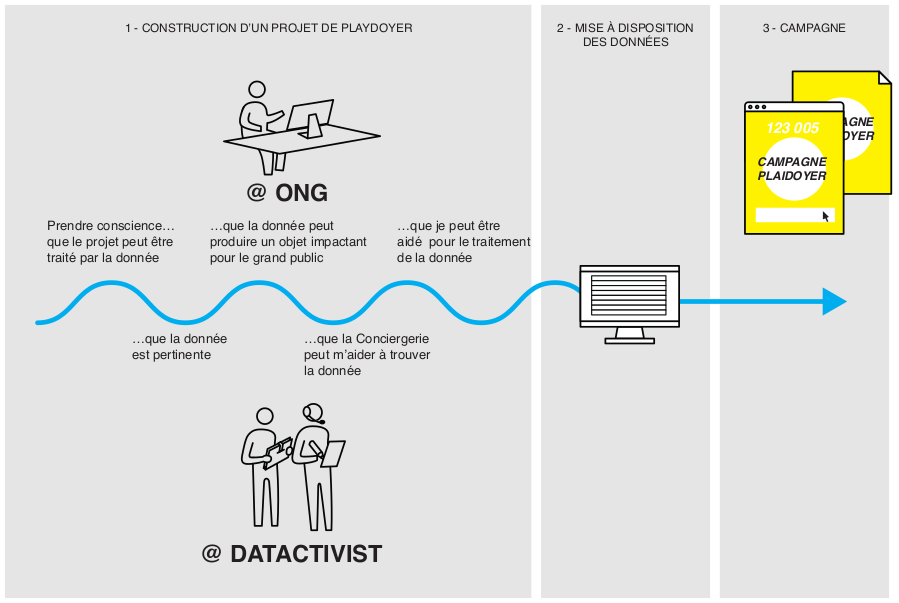
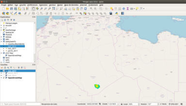
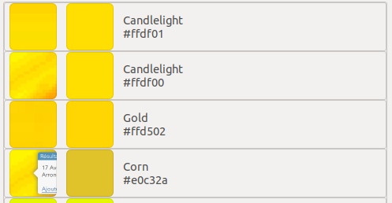
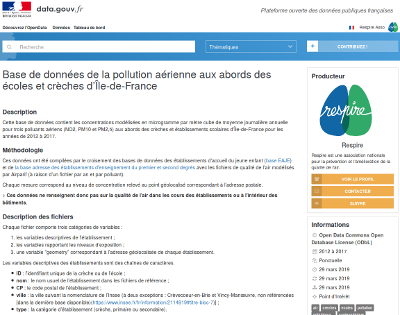
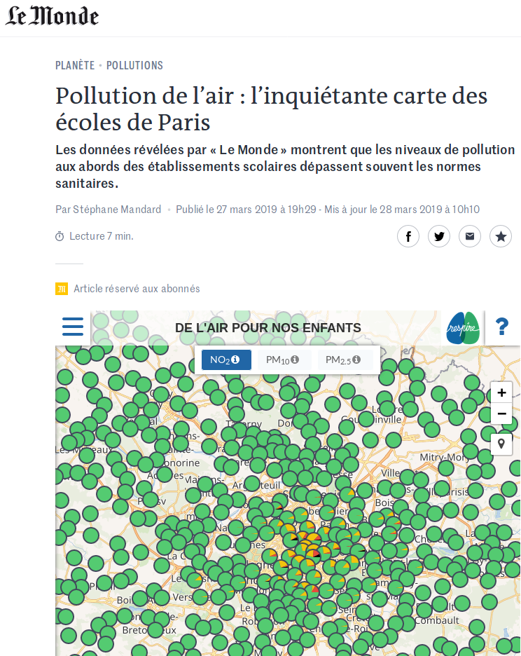
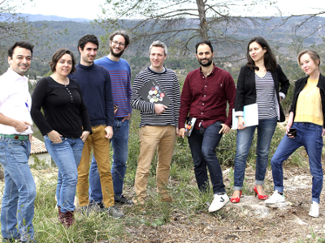

layout: true
  

`r paste0("
", params$event, " 

")` 

---

layout: true
  

`r paste0("
", params$event, " 

")` 

---
## Qui sommes nous ?

    

### We .red[open data], we make them .red[useful]

---
## Qui sommes nous ?

- Datactivist est un .red[**pure player de l’open data**] créé en 2016, par Samuel Goëta et Joël Gombin.

- Se positionnant sur .red[**toutes les étapes du travail d’ouverture des données**], Datactivist travaille tant avec les producteurs de données qu’avec les réutilisateurs et participe à l’appropriation des données par chacun·e.

- Nous appliquons nos propres .red[**valeurs**] : nous sommes une coopérative ; nos supports de formation et nos contenus sont librement réutilisables, publiés en licence Creative Commons.

- Notre approche est issue de la recherche (voir notamment **[la thèse de Samuel Goëta](https://datactivist.coop/these)**). 

- Nous animons la communauté [#TeamOpenData](https://teamopendata.org).

---
## Nos activités

- Conseil sur les .red[**stratégies d’ouverture de données**] : nous aidons les organisations dans la conception et la mise en œuvre de leur stratégie d’ouverture de données.

- .red[**Accompagnement dans la réutilisation de données ouvertes**] : nous aidons les organisations à utiliser les données au quotidien. 

- .red[**Sensibilisation et formation à la donnée**] : nous formons à la culture générale des données, nous enseignons les grands principes et bonnes pratiques de l'open data et nous introduisons à la data science. 

- .red[**Médiation de données**] : nous organisons des hackathons, des open data camps, des expéditions de données...

---
## Notre vision

### D'un open data de l'offre à un .red[open data de la demande]

Aujourd’hui, les administrations choisissent quelles données à ouvrir, quand et du comment .red[**sans consulter les usager·ère·s**].

Les rares données ouvertes sont souvent décevantes : pas à jour, trop agrégées, mal documentées, mal formatées... parfois inutilisables. 

Il faut aujourd’hui passer à l’étape supérieure : .red[**un open data piloté par la demande**].

Mais c'est difficile du fait de limites internes et externes aux organisations. Sans compter les freins culturels.

Mais les moyens d'action existent : demandes d'ouverture, plateformes, animations (ex : hackathon), gouvernance partagée...

---

class: inverse, center, middle

# "Données plaidoyer"

---

## Notre constat
### Un potentiel sous exploité

Notre pratique de l'open data dans divers champs (suivi des politiques publiques, comparaisons internationales, journalisme, etc.) nous a convaincu qu'il constituait un puissant levier :
* de .red[connaissance] par la documentation des faits politiques, sociaux, environnementaux ... ;
* de .red[mobilisation] par l'exposition des sources et la capacitation du public ;
* de .red[redevabilité] par la confrontation des producteur·rice·s à leurs responsabilités vis-à-vis de la société.

**Alors que le fonctionnement des ONGs procède voire dépend de ces trois leviers d'action politique, elles se saisissent peu voire pas de l'open data.**

--

> Nous proposons donc de mettre nos compétences spécifiques au service des ONGs pour les aider à mobiliser cet outil.

---

### Des freins culturels et structurels

Pour évaluer le besoin, nous avons organisé des rencontres avec des représentant·e·s d'ONGs engagé·e·s sur différents terrains (droit des femmes, écologie, justice fiscale, santé ...). Ces échanges nous ont permis de prendre conscience d'un enjeu sous estimé : avant même que se présente la problématique de la découverte ou de la réutilsation des données, **la faible culture de la donnée prive beaucoup d'organisation de l'idée même de sa pertinence**.

Nous avons tiré de ces réflexions un cheminement en quatre étapes, constituant des "points d'entrées" dans la réflexion quant à l'usage de la donnée :
1. *en quoi la donnée est-elle pertinente ?*
2. *puis-je en tirer un objet impactant ?*
3. *où et comment la trouver ?*
4. *comment traiter la traiter ?*

--

Datactivist se propose d'accompagner les ONGs **à partir de là où elles se situent dans leur questionnement**.

---

### La démarche "Données plaidoyer"

---

### La démarche "Données plaidoyer"

#### *accompagner les organisations à chaque étape de la mobilisation de l'open data dans leur plaidoyer*

Nous proposons aux ONGs de mobiliser nos compétences pour répondre à trois grands types de besoin :

1. aider à la compréhension de la donnée comme outil par .red[**l'acculturation**] (formation, aide à la réfexion, identification, etc.) ;
2. accompagner les démarches d'utilisation de la donnée, depuis sa recherche jusqu'à la production de contenu, par la mobilisation de .red[**méthodologies de recherche et de compétences techniques**] (aide à la recherche, traitement de données, data science, data visualisation, etc.) ;
3. assurer la crédibilité de la démarche et la bonne utilisation de toutes les ressources disponibles par le .red[**conseil juridique**] (demande de communication, requêtes Cada, accompagnement à la publication, etc.).

--

Pour illustrer ces démarches, nous vous proposons un cas concret mené récemment avec une ONG environnementale.

---

class: inverse, center, middle

## Cas pratique : Respire
### "De l'air pour nos enfants"

---

### 1. Analyse du besoin

#### Demande
Dans le cadre d'une campagne en faveur de la mise en place de "zone à faibles émissions" en Île-de-France, l'association pour la prévention et l'amélioration de la qualité de l'air **Respire** souhaitait réaliser une carte de la qualité de l'air aux abords des crèches et écoles de la région.

Pour se faire, elle proposait de s'appuyer sur les donnés récemment proposées en open data par les associations agréées de surveillance de la qualité de l'air (Aasqa), notamment Airparif.

#### Première approche
Au premier abord, les **données disponibles** semblaient recouper le **besoin**. Restait à réaliser un .red[**diagnostic**] pour s'en assurer avant de passer à la .red[**réutilisation**], c'est-à-dire à la production de la carte, support de campagne.

---

### 2. Ca se complique ...

.pull-left[

Le .red[**diagnostic**] fait vite apparaître plusieurs incohérences techniques :
* non conformité des données à la description ;
* problèmes de format ;
* problèmes de licence ;
* etc.
]

.pull-right[
L'équipe de Datactivist tente dans un premier temps de mobiliser son .red[**expertise technique**] pour constituer une base de données "a minima" (ou *"good enough data"*).

Pour cela, nous tentons de faire correspondre les couleurs aux légendes, suivant des méthodes d'approximation statistique. Hélas, la **qualité des données** s'avère insuffisante, nous obligeant à changer de stratégie.

]

---

### 3. Front juridique et front technique

Nous initions alors un échange avec le **producteur** des données, Airparif. Sur la base de notre expérience et de notre connaissance juridique quant au cadre légal de l'open data, nous accompagnons Respire dans la formalisation d'**une demande de communication des données**.

Dans le même temps, nous entamons des discussions avec l'équipe technique d'Airparif : nous transmettons une **documentation de notre démarche**, décrivant nos outils, les méthodes employées et les problèmes rencontrés. Ce faisant, nous formalisons une demande technique précise, compréhensible par le service technique et utile à la communauté.

Nous mobilisons donc parallèlement deux compétences :
* une .red[**expertise juridique**] pour faciliter la communication des données ;
* une .red[**connaissance technique**] nécessaire pour s'assurer de la **qualité des données**. Et donc de leur réutilisabilité.

---
### 4. Production d'un support

Une fois les données obtenues, nous passons à la production du support de campagne : la carte interactive, réalisée avec **un partenaire de notre écosystème**.

La carte est produite selon les demandes de Respire, en conformité avec les normes appliquées au secteur et suivant les priorités de la campagne en terme de message et de périmètre.

.pull-left[
Les données récupérées sont parallèlement mises à dispos sur data.gouv.fr. Nous accompagnons Respire dans cette publication : documentation, licence ouverte, référencement ... Nous nous assurons ainsi que l'action contribue à **la démarche d'ouverture des données d'intérêt général**.

.
]

.pull-right[

]

---
background-image: url("./img/respire-carte-full.png")

---

#### 5. Retombées

.pull-left[
#### Médiatiques
La carte a été reprise par de nombreux médias nationaux et a fait l'ouverture des journaux de toutes les grandes radios nationales : France Inter, RTL, Europe 1, France info, France culture ...

]

.pull-right[
#### Politiques
La carte a suscité des réactions de responsables politiques de premier plan, à commencer par la maire de Paris **Anne Hidalgo** ainsi que plusieurs élu·e·s locaux·ales du Grand-Paris et **François de Rugy**, ministre de l'Ecologie.

#### Publiques
La carte a été consultée plus de 10000 fois en 24 heures et la pétition qui y était liée a recueilli plus de 22000 signatures en deux semaines. Des parents d'élèves, associations et autres organisations ont sollicité Respire pour des campagnes ciblées.
]

---

## L'équipe Datactivist
Datactivist réunit des compétences et profils variés à même de couvrir la majorité des besoins liés à l'utilisation de la donnée :

.pull-left[

* une géomaticienne spécialisée dans l'open data régional ;
* un consultant spécialisé dans l'open data local ;
]

.pull-right[
* un docteur en informatique spécialisé dans le traitement du langage ;
* un data scientist et politologue spécialisé dans la géographie électorale ;
* un consultant et docteur en sociologie auteur d'une thèse sur l'open data ;
* une consultante spécialiste du gouvernement ouvert ;
* une consultante spécialisée en politique locale ;
* un datajournaliste spécialisé en data literacy.]

---

## Un engagement collectif

Société coopérative, Datactivist s'inscrit dans le mouvement de l'open data dans sa dimension technique mais aussi politique.

**Au delà d'une simple responsabilité sociale, notre démarche "Données plaidoyer" entend faciliter l'entrée des organisations de défense de l'intérêt général dans la communauté des données ouvertes pour en faire un nouveau levier d'information, de mobilisation et d'action collective**.

  

---
class: inverse, center, middle

# Merci !

Contact : [sylvain@datactivist.coop](mailto:sylvain@datactivist.coop)