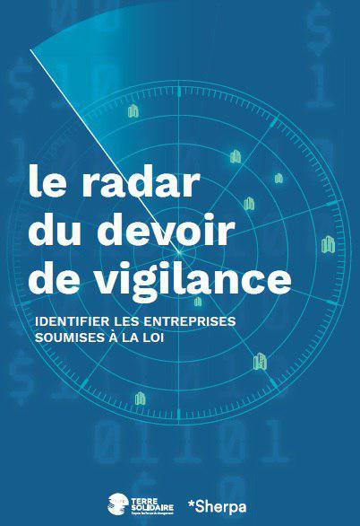
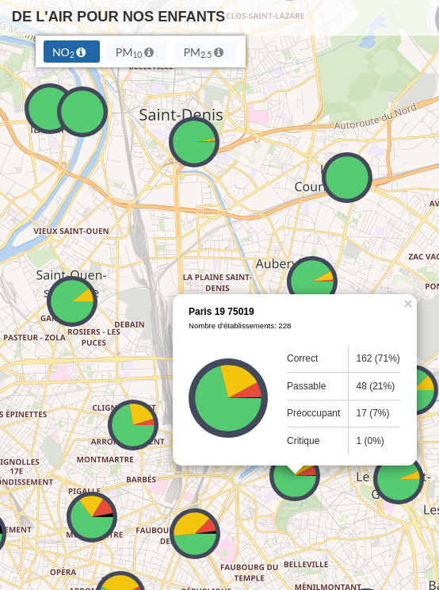
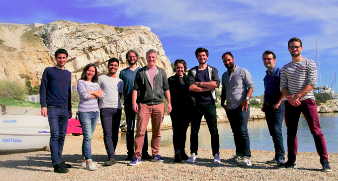

layout: true
  

`r paste0("
", params$event, " 

")` 

---

layout: true
  

`r paste0("
", params$event, " 

")` 

---
## Qui sommes-nous ?

    

### We .red[open data], we make them .red[useful]

---
## Qui sommes-nous ?

- Datactivist est un .red[**pure player de l’open data**] créé en 2016, par Samuel Goëta et Joël Gombin.

- Se positionnant sur .red[**toutes les étapes du travail d’ouverture des données**], Datactivist travaille tant avec les producteurs de données qu’avec les réutilisateurs et participe à l’appropriation des données par chacun·e.

- Nous appliquons nos propres .red[**valeurs**] : nous sommes une coopérative ; nos supports de formation et nos contenus sont librement réutilisables, publiés en licence Creative Commons.

- Notre approche est issue de la recherche (voir notamment **[la thèse de Samuel Goëta](https://datactivist.coop/these)**). 

- Nous animons la communauté [#TeamOpenData](https://teamopendata.org).

---
## Nos activités

- Conseil sur les .red[**stratégies d’ouverture de données**] : nous aidons les organisations dans la conception et la mise en œuvre de leur stratégie d’ouverture de données.

- .red[**Accompagnement dans la réutilisation de données ouvertes**] : nous aidons les organisations à utiliser les données au quotidien. 

- .red[**Sensibilisation et formation à la donnée**] : nous formons à la culture générale des données, nous enseignons les grands principes et bonnes pratiques de l'open data et nous introduisons à la data science. 

- .red[**Médiation de données**] : nous organisons des hackathons, des open data camps, des expéditions de données...

---
## Notre vision

### D'un open data de l'offre à un .red[open data de la demande]

Aujourd’hui, les administrations choisissent quelles données à ouvrir, quand et comment .red[**sans consulter les usager·ère·s**].

Les rares données ouvertes sont souvent décevantes : pas à jour, trop agrégées, mal documentées, mal formatées... parfois inutilisables. 

Il faut aujourd’hui passer à l’étape supérieure : .red[**un open data piloté par la demande**].

C'est difficile du fait de limites internes et externes aux organisations. Sans compter les freins culturels.

Mais les moyens d'action existent : demandes d'ouverture, plateformes, animations (ex : hackathon), gouvernance partagée...

---

class: inverse, center, middle

# Données et OSCs : notre constat

---

## Opportunités

### Un potentiel sous-exploité

Notre pratique de l'open data dans divers champs (suivi des politiques publiques, comparaisons internationales, journalisme, etc.) nous a convaincu qu'il constituait un puissant levier :
* de .red[connaissance] par la documentation des faits politiques, sociaux, environnementaux ... ;
* de .red[mobilisation] par l'exposition des sources et la capacitation du public ;
* de .red[redevabilité] par la confrontation des producteur·rice·s à leurs responsabilités vis-à-vis de la société.

**Alors que le fonctionnement des ONGs procède voire dépend de ces trois leviers d'action politique, elles se saisissent peu voire pas de l'open data.**

---

## Freins

Des échanges et collaborations avec de nombreuses ONGs et OSCs dans des domaines variés (environnement, justice sociale, droits des femmes, développement, droits des salariés ...) nous ont permis d'identifier plusieurs freins structurels à la mobilisation de la donnée dans la démarche de plaidoyer :

1. une culture du plaidoyer juridique, de terrain ... peu chiffrée ;
2. des modes de communication inadaptés (formats, canaux, publics...) ;
3. la forte redevabilité vis-à-vis des donnateur·rice·s ;
4. les priorités de campagne orientées vers la production d'argumentaires plus que de supports ;
5. l'absence de compétences internes (en dehors de postes liés au budget ou à la communauté)
6. la difficulté de budgéter ces dépenses.

--

Au croisement de ces difficultés, un facteur commun ou agravant nous apparaît de manière criante : **.red[le manque courant d'une véritable culture de la donnée dans les organisations]**.

---

### Culture de la donnée

.pull-left[La "**culture de la donnée**" (ou "**.red[data literacy]**") recouvre les compétences théoriques et pratiques permettant de comprendre et manipuler les données en elles-mêmes et de les replacer dans leur contexte de production, d'utilisation et de diffusion.

]

.pull-right[Dans le cas particulier des OSCs, la culture de la donnée renvoie aux connaissances et méthodes nécessaires à la compréhension du lien entre les problématiques politiques qu'elles traitent et les données existantes ou productibles permettant de mieux comprendre les phénomènes ou les politiques censées les influencer.

**La culture de la donnée constitue ainsi une compétence charnière entre l'expertise des organisations et les nouvelles sources d'information et modes de production de preuve en jeu dans les débats publics.**
]

---

### Les besoins liés à la donnée

[...]

1.  `r emo::ji("woman_teacher")` `r emo::ji("man_teacher")` .red[**la formation / la sensibilisation**] ;
2.  `r emo::ji("male_detective")` `r emo::ji("flashlight")` .red[**la conciergerie**] ;
3.  `r emo::ji("man_mechanic")` `r emo::ji("wrench")` .red[**l'outillage**] ;
4.  `r emo::ji("man_singer")` `r emo::ji("woman_singer")` .red[**la médiation**] ;
5.  `r emo::ji("tipping_hand_woman")` `r emo::ji("information")` .red[**le conseil**].

---

class: inverse, center, middle

# Notre offre de service : Données plaidoyer

---

## Des briques de service

L'offre **.red[Données plaidoyer]** se compose d'un ensemble de *"briques"* correspondant aux besoins identifiés. Chacun de ces services modulaires peut être assemblé et complété par d'autres suivant la culture de l'organisation, son fonctionnement, ses besoins et son calendrier.

La pertinence de l'utilisation de données doit être évaluée dans l'échange avec les membres de l'organisation : à la compétence interne sur les sujets et les cibles du plaidoyer, nous proposons d'apporter une expertise data sur trois principaux volets :
* connaissance des outils ;
* connaissance des méthodes ;
* connaissance du cadre légal.

---
.center[
###  `r emo::ji("woman_teacher")` Formation et sensibilisation `r emo::ji("man_teacher")`
]

**.red[L'acquisition d'une culture et de compétences liées à la donnée nous apparaît comme un préalable à tout projet de plaidoyer mobilisant la donnée]**. La connaissance des possibilités techniques, des outils disponibles et des expériences passées offre un cadre de réflexion qui facilite l'implication en interne, la prise de décision et l'autonomisation des équipes sur ces sujets.
.center[
### Notre offre
]
* **Formats** : d'une matinée à plusieurs jours;
* **Public** : tout public (des novices aux data scientists);
* **Compétences internes** : un datajournaliste, deux data scientists, une géomaticienne, trois consultant·e·s en politique publique.
* **Thématiques** : data literacy, open data, sources de données, législation, droit d'accès à l'information, traitement de la donnée, visualisation de la donnée, data science.
* **Livrables** : les supports de formation sont tous mis à disposition en accès libre sur notre Github sous licence Creative Commons.

---

### Ex. : Open data médias I & II

.footnote[Entre 2016 et 2018, Datactivist a conçu et animé pour l'agence **CFI Médias** deux programmes qui ont permis de former une trentaine de journalistes activistes de 13 pays d'Afrique francophone à l'open data et au traitement de données : [Open Data Médias 1](http://www.cfi.fr/fr/projet/opendata-medias) et [Open Data Médias 2](https://www.cfi.fr/fr/projet/opendata-medias-2).]

---
.center[
### `r emo::ji("male_detective")` La conciergerie de données `r emo::ji("flashlight")`
]

**.red[L'utilisation de données ouvertes pour le plaidoyer et la communication vis-à-vis des adhérent·e·s ou donateur·rice·s offre conjointement crédibilité et transparence au propos]**. D'où l'importance d'une bonne traduction des questionnements en requête, une connaissance large des sources disponibles, une évaluation rigoureuse de la qualité des données et un nettoyage programmatique ... terme que nous avons réuni sous le vocable *.red[conciergerie de données]*.

.center[
### Notre offre
]
* **Besoins** : rédaction de rapport, préparation de campagne, préparation de conférence, production de support.
* **Thématiques** : économie, environnement, énergie, politiques publiques, santé, société, RSE ...
* **Livrables** : les données sont transmises au format demandé et mises à disposition sur un portail d'open data sous licence Creative Commons avec documentation

---

### Ex. : le Radar du Devoir de vigilance

.pull-left[

]

.pull-right[
Dans le cadre de leur campagne sur la responsabilité sociale et environnementale des entreprises, **CCFD Terres Solidaires** et **Sherpa** ont fait appel à Datactivist pour établir une liste des entreprises concernées par la loi Devoir de vigilance : établissemnt d'une méthodologie, traitement des données, vérification et documentation.

Ce travail a permis la rédaction du rapport [Le radar du devoir de vigilance](https://plan-vigilance.org/le-radar-du-devoir-de-vigilance/) et la mise en place d'un site de veille sur le sujet : [Plan-Vigilance.org](https://plan-vigilance.org).
]

---

.center[
### `r emo::ji("man_mechanic")` Création d'outils `r emo::ji("wrench")`
]

**.red[La création d'outils alimentés par des données ouvertes permet d'offrir des fonctionnalités avancées dans la collecte, traitement et exploration de données en les rendant durables et améliorables dans le temps]**.

.center[
### Notre offre
]
* **Besoins** : outils de veille, outils de recherche, datavisualisations interactives, interfaces de collecte ou d'exploration des données ;
* **Outils** : R et Python (traitement des données), frameworks de recherche (Aleph) et de traitement du langage naturel (spaCy), CMS (Wordpress, Hugo ...) et autres outils via notre réseau.
* **Compétences** : traitement de la donnée en interne et, en externe, réseau de développeur, designer et web designer ;
* **Livrables** : l'outil est installé sur un serveur mis à disposition par le client et son code est mis à disposition sur une plateforme spécialisée sous licence Creative Commons et documenté.

---

### Ex. : De l'air pour nos enfants

.pull-left[
L'association **Respire** a fait appel à Datactivist pour réaliser une étude la qualité de l'air aux abords des écoles d'Île-de-France dans le cadre de sa campagne pour la mise en place de zones à faibles émissions. Assisté pour le webdesign par l'agence de développement informatique *Servebox*, notre équipe a traité et analysés les données et publié [une carte interactive](https://carte-des-ecoles.de-l-air-pour-nos-enfants.fr/) couvrant six années, trois polluants et tous les établissements, de la crèche au lycée. L'association a parallèllement publié [un rapport](https://www.respire-asso.org/carte-des-ecoles/) réalisé à partir de ces données.
]

.pull-right[

]

---
.center[
###  `r emo::ji("man_singer")` Médiation `r emo::ji("woman_singer")`
]

**.red[L'organisation d'un événement autour de la réutilisation ou de la publication des données permet de structurer la communauté autour d'un enjeu et d'identifier les contributeur·rice·s clefs pour promouvoir un plaidoyer et alimenter le débat public]**.

.center[
### Notre offre
]
* **Formats** : hackathon, hackaviz, conférences, séminaires ... d'une demi-journée à trois jours d'événement ;
* **Public** : tout public (grand public, institutionnels, professionnels d'un secteur ...) ;
* **Prestation** : gestion de projet, communication, identification des publics, élaboration des règlements, rédaction des supports, logistique, animation ;
* **Livrables** : un livret est rédigé à l'attention du client et/ou des participant·e·s établissant le bilan de l'événement (conclusions, déroulement, participation, axes forts, développements possibles).

---

### Ex. : Hackathon Paris Peace Forum

.pull-left[

]

.pull-right[
Datactivist a organisé et animé du 11 au 13 novembre 2018 [le hackathon de la conférence **Forum de Paris pour la paix**](https://parispeaceforum.org/fr/hackathon/) qui a rassemblé 65 participant·e·s et 15 mentors de 30 pays. Durant cet événement, les équipes ont produit des études et visualisations sur des thématiques telles que le budget des organisations internationales, le changement climatique et la transparence de la commande publique.
]

---

.center[
###  `r emo::ji("tipping_hand_woman")` Conseil `r emo::ji("information")`
]

.center[
### Notre offre
]
* **Livrables** :

---

Exemple de conseil

---

### L'ouverture appliquée à soi-même

**L'open data constitue pour Datactivist un outil autant qu'un principe qui guide notre action.** Ou, pour reprendre une expression consacrée en interne : *nous goûtons notre propre soupe*.

Cela se traduit concrètement par la documentation et la publication systématique de nos projets :
* nous publions tous nos supports de présentation (le plus souvent sur Github) ;
* nous rendons public le code de nos scripts et contribuons abondemment à des projets open source dans différents domaines ;
* nous mettons les données produites avec et pour nos client·e·s sur des sites ou plateformes ouvertes sous des licences permettant leur libre réutilisation.

Dans le cas des sujets de plaidoyer, **.red[l'open data et les licences ouvertes nous paraîssent des véhicules puissants pour faire circuler les nouveaux outils et les nouveaux arguments pour nourrir l'action d'intérêt général]**.

---

## Modalités de financement

Notre offre de service Données plaidoyer peut être mobilisée comme une simple prestation de service : à l'issue d'un entretien visant à établir les besoins et les éventuels chantiers, notre équipe établira un ou plusieurs devis suivant les actions envisagées avec le client en quantifiant notre travail en jour / personne. La prestation est ensuite facturée conformément au devis validé par le client.

Mais du fait de l'objet de notre action (l'open data) et de la culture coopérative qui porte notre action, nous pensons utile et pertinent de proposer d'autres modes de financement de ce type d'action afin d'élargir l'accès à ce type de service tout en se rémunérant de notre travail :
1. le financement par coalition ;
2. un modèle d'abonnement.

---

### Financement par coalition

Les questions d'intérêt général mobilisant souvent plusieurs organisations d'un champs simultanément, la collecte, le traitement ou la diffusion de données sur ces débats nous apparaissent comme un bénéfice commun plutôt qu'un objet de concurrence.

A ce titre, nous pensons pertinent et vertueux d'organiser des **.red[coalitions de plaidoyer par la donnée]**, capables de mettre en commun leurs interrogations, leurs calendriers et leurs moyens pour aider à la mobilisation des données dans leur champs.

Le modèle est celui des consortiums de journalistes qui fleurissent pour créer les synergies nécessaires à des enjeux globaux et techniquement complexes :
* [Icij](https://www.icij.org/) qui a permis des révélations sur la fraude fiscale ;
* [OCCRP](https://www.occrp.org/) qui soutient les enquêtes sur la corruption en Europe.

---

### Financement par abonnement

Au delà des briques de service, nous souhaitons structurer notre offre de service pour les données d'intérêt général autour d'un modèle réactif et pérenne économiquement. En bref, **.red[faire de Données plaidoyer une plateforme de service par abonnement et de mise en commun des fruits des travaux effectués]**.

[...]

---
.center[
### A suivre ...

]

.footnote[Au travers ses activités et les profils qu'elle réunit, l'équipe de **.red[Datactivist]** souhaite apporter aux organisations de la société civile toutes les projets qu'elle développe : moteurs de recherche personnalisés, coopérative de données, outils de suivi des demandes d'ouverture de données ... Et bien d'autres idées dont nous avons hâte de vous parler !]

---
class: inverse, center, middle

# Parlons-en !

Contact : [sylvain@datactivist.coop](mailto:sylvain@datactivist.coop)
