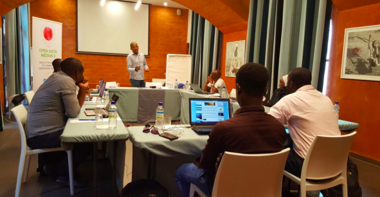
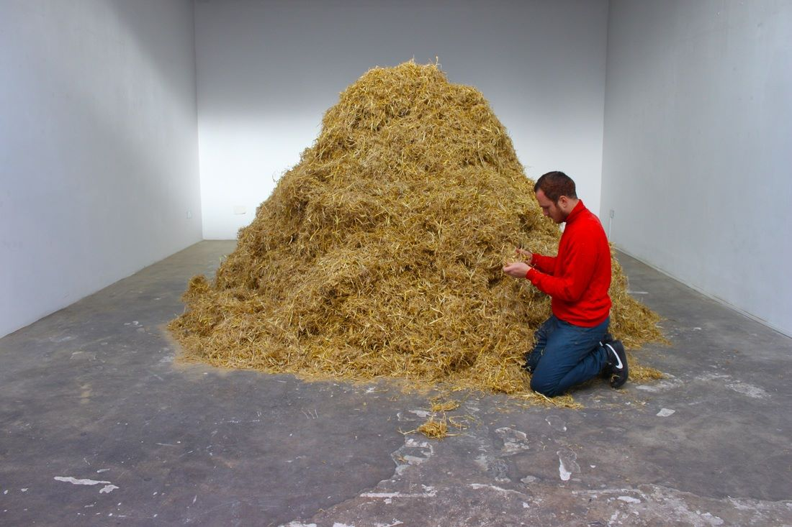

layout: true
  

`r paste0("
", params$event, " 

")` 

---

layout: true
  

`r paste0("
", params$event, " 

")` 

---
## Qui sommes-nous ?

    

### We .red[open data], we make them .red[useful]

---
## Qui sommes-nous ?

- Datactivist est un .red[**pure player de l’open data**] créé en 2016, par Samuel Goëta et Joël Gombin.

- Se positionnant sur .red[**toutes les étapes du travail d’ouverture des données**], Datactivist travaille tant avec les producteurs de données qu’avec les réutilisateurs et participe à l’appropriation des données par chacun·e.

- Nous appliquons nos propres .red[**valeurs**] : nous sommes une coopérative ; nos supports de formation et nos contenus sont librement réutilisables, publiés en licence Creative Commons.

- Notre approche est issue de la recherche (voir notamment **[la thèse de Samuel Goëta](https://datactivist.coop/these)**). 

- Nous animons la communauté [#TeamOpenData](https://teamopendata.org).

---
## Nos activités

- Conseil sur les .red[**stratégies d’ouverture de données**] : nous aidons les organisations dans la conception et la mise en œuvre de leur stratégie d’ouverture de données.

- .red[**Accompagnement dans la réutilisation de données ouvertes**] : nous aidons les organisations à utiliser les données au quotidien. 

- .red[**Sensibilisation et formation à la donnée**] : nous formons à la culture générale des données, nous enseignons les grands principes et bonnes pratiques de l'open data et nous introduisons à la data science. 

- .red[**Médiation de données**] : nous organisons des hackathons, des open data camps, des expéditions de données...

---
## Notre vision

### D'un open data de l'offre à un .red[open data de la demande]

Aujourd’hui, les administrations choisissent quelles données à ouvrir, quand et comment .red[**sans consulter les usager·ère·s**].

Les rares données ouvertes sont souvent décevantes : pas à jour, trop agrégées, mal documentées, mal formatées... parfois inutilisables. 

Il faut aujourd’hui passer à l’étape supérieure : .red[**un open data piloté par la demande**].

C'est difficile du fait de limites internes et externes aux organisations. Sans compter les freins culturels.

Mais les moyens d'action existent : demandes d'ouverture, plateformes, animations (ex : hackathon), gouvernance partagée...

---

class: inverse, center, middle

# Données et OSCs : notre constat

---

## Opportunités

### Un potentiel sous-exploité

Notre pratique de l'open data dans divers champs (suivi des politiques publiques, comparaisons internationales, journalisme, etc.) nous a convaincu qu'il constituait un puissant levier :
* de .red[connaissance] par la documentation des faits politiques, sociaux, environnementaux ... ;
* de .red[mobilisation] par l'exposition des sources et la capacitation du public ;
* de .red[redevabilité] par la confrontation des producteur·rice·s à leurs responsabilités vis-à-vis de la société.

**Alors que le fonctionnement des ONGs procède voire dépend de ces trois leviers d'action politique, elles se saisissent peu voire pas de l'open data.**

---

## Freins

Des échanges et collaborations avec de nombreuses ONGs et OSCs dans des domaines variés (environnement, justice sociale, droits des femmes, développement, droits des salariés ...) nous ont permis d'identifier plusieurs freins structurels à la mobilisation de la donnée dans la démarche de plaidoyer :

1. une culture du plaidoyer juridique, de terrain ... peu chiffrée ;
2. des modes de communication inadaptés (formats, canaux, publics...) ;
3. la forte redevabilité vis-à-vis des donnateur·rice·s ;
4. les priorités de campagne orientées vers la production d'argumentaires plus que de supports ;
5. l'absence de compétences internes (en dehors de postes liés au budget ou à la communauté)
6. la difficulté de budgéter ces dépenses.

--

Au croisement de ces difficultés, un facteur commun ou agravant nous apparaît de manière criante : **.red[le manque courant d'une véritable culture de la donnée dans les organisations]**.

---

### Culture de la donnée

.pull-left[La "**culture de la donnée**" (ou "**.red[data literacy]**") recouvre les compétences théoriques et pratiques permettant de comprendre et manipuler les données en elles-mêmes et de les replacer dans leur contexte de production, d'utilisation et de diffusion.

]

.pull-right[Dans le cas particulier des OSCs, la culture de la donnée renvoie aux connaissances et méthodes nécessaires à la compréhension du lien entre les problématiques politiques qu'elles traitent et les données existantes ou productibles permettant de mieux comprendre les phénomènes ou les politiques censées les influencer.

**La culture de la donnée constitue ainsi une compétence charnière entre l'expertise des organisations et les nouvelles sources d'information et modes de production de preuve en jeu dans les débats publics.**
]

---

### Les besoins liés à la donnée

1.  `r emo::ji("woman_teacher")` `r emo::ji("man_teacher")` .red[**la formation / la sensibilisation**] : data literacy, modalité de recours, traitement et visualisation des données ... l'acquisition de ces compétences permet aux équipes de mieux identifier et comprendre le potentiel des données et de les mobiliser à propos en interne et en externe ;
2.  `r emo::ji("male_detective")` `r emo::ji("flashlight")` .red[**la conciergerie**] : identifier les sources pertinentes, évaluer la qualité des données, trouver les bons jeux ... la traduction des besoins d'information en modalités de recherche alimente et consolide le travail de documentation en assurant la fiabilité des informations utilisées ;
3.  `r emo::ji("man_mechanic")` `r emo::ji("wrench")` .red[**l'outillage**] : un moteur de recherche sur mesure, une "moulinette" pour structurer une veille ... les instruments alimentés par la donnée permettent d'automatiser des tâches courantes et de rendre accessibles les informations clefs de l'action ou du message des organisations ;
4.  `r emo::ji("man_singer")` `r emo::ji("woman_singer")` .red[**la médiation**] : organiser un hackathon, structurer une opération de crowdsourcing ou monter une conférence permettent de structurer le lien avec le grand public ou une communauté spécifique autour de la donnée ;
5.  `r emo::ji("tipping_hand_woman")` `r emo::ji("information")` .red[**le conseil**] : l'open data constitue en soi une branche du droit à l'information avec des ramifications dans le droit administratif, le droit des sociétés, le droit de l'environnement ... savoir se frayer un chemin pour trouver quel levier activer, que ce soit pour publier ou rendre publique des donneés, ouvre des champs d'action nouveau.

---

class: inverse, center, middle

# Notre offre de service : Données plaidoyer

---

## Des briques plutôt que des calques

La pertinence de l'utilisation de données doit être évaluée dans l'échange avec les membres de l'organisation : à la compétence interne sur les sujets et les cibles du plaidoyer, nous proposons d'apporter une expertise data sur trois principaux volets :
* connaissance des outils ;
* connaissance des méthodes ;
* connaissance du cadre légal.

1.  `r emo::ji("woman_teacher")` `r emo::ji("man_teacher")` .red[**la formation / la sensibilisation**] : data literacy, modalité de recours, traitement et visualisation des données ... l'acquisition de ces compétences permet aux équipes de mieux identifier et comprendre le potentiel des données et de les mobiliser à propos en interne et en externe ;
2.  `r emo::ji("male_detective")` `r emo::ji("flashlight")` .red[**la conciergerie / la recherche et qualificaiton des données**] : identifier les sources pertinentes, évaluer la qualité des données, trouver les bons jeux ... la traduction des besoins d'information en modalités de recherche alimente et consolide le travail de documentation en assurant la fiabilité des informations utilisées ;
3.  `r emo::ji("man_mechanic")` `r emo::ji("wrench")` .red[**l'outillage**] : un moteur de recherche sur mesure, une "moulinette" pour structurer une veille ... les instruments alimentés par la donnée permettent d'automatiser des tâches courantes et de rendre accessibles les informations clefs de l'action ou du message des organisations ;
4.  `r emo::ji("man_singer")` `r emo::ji("woman_singer")` .red[**la médiation**] : organiser un hackathon, structurer une opération de crowdsourcing ou monter une conférence permettent de structurer le lien avec le grand public ou une communauté spécifique autour de la donnée ;
5.  `r emo::ji("tipping_hand_woman")` `r emo::ji("information")` .red[**le conseil**] : l'open data constitue en soi une branche du droit à l'information avec des ramifications dans le droit administratif, le droit des sociétés, le droit de l'environnement ... savoir se frayer un chemin pour trouver quel levier activer, que ce soit pour publier ou rendre publique des donneés, ouvre des champs d'action nouveau.

---

###  `r emo::ji("woman_teacher")` Formation et sensibilisation `r emo::ji("man_teacher")`

Data literacy, modalité de recours, traitement et visualisation des données ... l'acquisition de ces compétences permet aux équipes de mieux identifier et comprendre le potentiel des données et de les mobiliser à propos en interne et en externe.

Offre

---

### Formation : Open data médias I & II

Entre 2016 et 2018, Datactivist a conçu et animé deux programmes de formation à l'open data et au traitement des données à destination de la société civile d'Afrique francophone : [Open Data Médias 1](http://www.cfi.fr/fr/projet/opendata-medias) et [Open Data Médias 2](https://www.cfi.fr/fr/projet/opendata-medias-2).

---

### `r emo::ji("male_detective")` La conciergerie de données `r emo::ji("flashlight")`

Identifier les sources pertinentes, évaluer la qualité des données, trouver les bons jeux ... la traduction des besoins d'information en modalités de recherche alimente et consolide le travail de documentation en assurant la fiabilité des informations utilisées.

Offre

---

Exemple

---

### `r emo::ji("man_mechanic")` Création d'outils `r emo::ji("wrench")`

Un moteur de recherche sur mesure, une "moulinette" pour structurer une veille ... les instruments alimentés par la donnée permettent d'automatiser des tâches courantes et de rendre accessibles les informations clefs de l'action ou du message des organisations ;

Offre

---

Exemple

---

###  `r emo::ji("man_singer")` Médiation `r emo::ji("woman_singer")`

Organiser un hackathon, structurer une opération de crowdsourcing ou monter une conférence permettent de structurer le lien avec le grand public ou une communauté spécifique autour de la donnée.

Offre

---

Exemple

---

###  `r emo::ji("tipping_hand_woman")` Conseil `r emo::ji("information")`

L'open data constitue en soi une branche du droit à l'information avec des ramifications dans le droit administratif, le droit des sociétés, le droit de l'environnement ... savoir se frayer un chemin pour trouver quel levier activer, que ce soit pour publier ou rendre publique des donneés, ouvre des champs d'action nouveau.

Offre

---

Exemple

---

### L'ouverture appliquée à soi-même

**L'open data constitue pour Datactivist un outil autant qu'un principe qui guide notre action.** Ou, pour reprendre une expression consacrée en interne : *nous goûtons notre propre soupe*.

Cela se traduit concrètement par la documentation et la publication systématique de nos projets :
* nous publions tous nos supports de présentation (le plus souvent sur Github) ;
* nous rendons public le code de nos scripts et contribuons abondemment à des projets open source dans différents domaines ;
* nous mettons les données produites avec et pour nos client·e·s sur des sites ou plateformes ouvertes sous des licences permettant leur libre réutilisation.

Dans le cas des sujets de plaidoyer, **.red[l'open data et les licences ouvertes nous paraîssent des véhicules très puissants pour faire circuler les nouveaux outils et les nouveaux arguments pour nourrir l'action d'intérêt général]**.

---

## Modalités de financement

---

## Besoins de données

Outre la diversité des sujets et des usages attendus, les typologies de besoins de données que nous avons pu identifier en échangeant avec nos intrelocuteur·rice·s variaient suivant trois paramètres principaux :
1. **l'identification des sources** : là où certaines organisations avaient déjà en tête une liste précise, d'autres doutaient même de l'existence de bases de données rassemblant les données recherches ;
2. **la dispersion de l'information** : par leur étendue thématique, historique, spatiale ou politique, certaines recherches nécessitaient structurellement un très grand nombre de sources, soit hétérogènes, soit très variées (que ce soit en format ou en producteur) ;
3. **la définition des cibles** : les critères de définition des "cibles" variaient en précision. Soit parce que les méthodes de compilation brouillaient le lien entre entité réelle et donnée répertoriée. Soit parce que le résultat même de la recherche devait aider à préciser la nature du mécanisme.

--

Nous avons résumé ces typologies en quatre cas types, correspondant à des problématiques évoquées par nos interlocuteur·rice·s.

---

#### Une aiguille dans une botte de foin

Les critères de recherche sont clairs mais la source est complexe et trop abondante pour être traitée manuellement.

---

#### Une aiguille dans plusieurs bottes de foin

Les informations à trouver sont bien déterminées mais les bases de données sont multiples en formats et en organisation : au temps de recherche manuel s'ajoute la nécessité d'établir des systèmes de comparaison fiables.

---

#### Une aiguille dans un champs de blé

La forme des informations à récolter est définie mais aucune base de donnée n'est constituée a priori : des références existent de manière disparate sans socle commun, ni standard (articles de presse, publications officielles, post sur les réseaux sociaux, etc.).

---

#### Des objets métalliques pointus de formes indéterminées dans des surfaces en polyculture maraichère
Le type d'information à collecter n'est pas clairement défini et la nature des sources possibles non plus. Le problème n'est plus seulement ici de réaliser la recherche mais d'établir la forme des données existantes sur le sujet et d'établir le périmètre de recherche pour les trouver.

.center[

]

.footnote[*Note : ces illustrations sont tirées des performances de l'artiste italien [Sven Sachsalber*](https://www.francetvinfo.fr/culture/apres-l-artiste-plus-de-17-heures-de-recherche-l-artiste-sven-sachsalber-a-trouve-une-aiguille-dans-une-botte-de-foin_744837.html).]

---

## Usages de la donnée

Outre la diversité des sujets et des usages attendus, les typologies de besoins de données que nous avons pu identifier en échangeant avec nos intrelocuteur·rice·s variaient suivant trois paramètres principaux :
1. **l'identification des sources** : là où certaines organisations avaient déjà en tête une liste précise, d'autres doutaient même de l'existence de bases de données rassemblant les données recherches ;
2. **la dispersion de l'information** : par leur étendue thématique, historique, spatiale ou politique, certaines recherches nécessitaient structurellement un très grand nombre de sources, soit hétérogènes, soit très variées (que ce soit en format ou en producteur) ;
3. **la définition des cibles** : les critères de définition des "cibles" variaient en précision. Soit parce que les méthodes de compilation brouillaient le lien entre entité réelle et donnée répertoriée. Soit parce que le résultat même de la recherche devait aider à préciser la nature du mécanisme.

---

# Notre équipe

---
class: inverse, center, middle

# Merci !

Contact : [sylvain@datactivist.coop](mailto:sylvain@datactivist.coop)
